# ArtitechCore — AI Website Builder, Schema.org JSON-LD & SEO Content Suite for WordPress

> Build full websites, auto-generate schema.org structured data, and enhance content for SEO — with OpenAI, Google Gemini, or DeepSeek inside your WordPress dashboard.

**ArtitechCore** is a WordPress SEO and site-building plugin that combines three things agencies usually buy separately: an **AI website builder** (industry blueprints → full page ecosystems), an **automatic schema.org JSON-LD engine** (FAQ, Service, MedicalBusiness, Article, LocalBusiness, Organization, and more — one valid `@graph` per URL), and an **AI content enhancer** (Key Takeaways, Smart Conclusions, brand-matched CTAs). It runs **alongside** Yoast / Rank Math (additive mode), never against them.

- 🔌 Works with OpenAI, Google Gemini, and DeepSeek — you bring your own API key
- 🏥 Industry-aware: dental, legal, restaurant, e-commerce, services, portfolio, corporate blueprints
- ✅ Valid structured data: single most-specific `@type`, enum-only `medicalSpecialty`, `@id`-deduped graphs
- 🔒 Keys stored in your database only, server-to-server calls, no frontend exposure

---

## 🎬 Live tour (26 sec, recorded in sandbox on v1.0.0)

Schema dashboard → AI Generator → Website Builder → Content Enhancer → live frontend page with JSON-LD in source.

▶️ Full video: [`.github/readme/artitechcore-tour.mp4`](.github/readme/artitechcore-tour.mp4)

---

## Screenshots (taken live in sandbox, v1.0.0)

### 1. Manual Page Creation — build hierarchies by hand
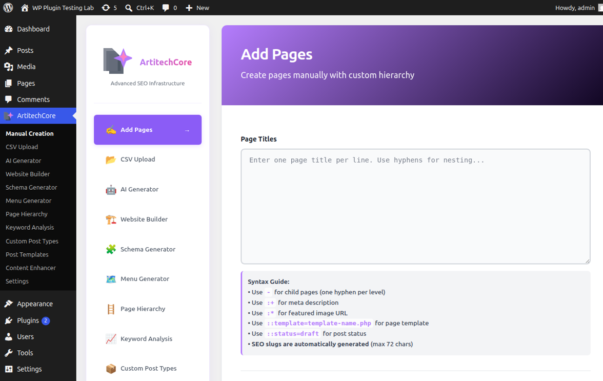

### 2. Schema Generator — dashboard, coverage stats, bulk generate
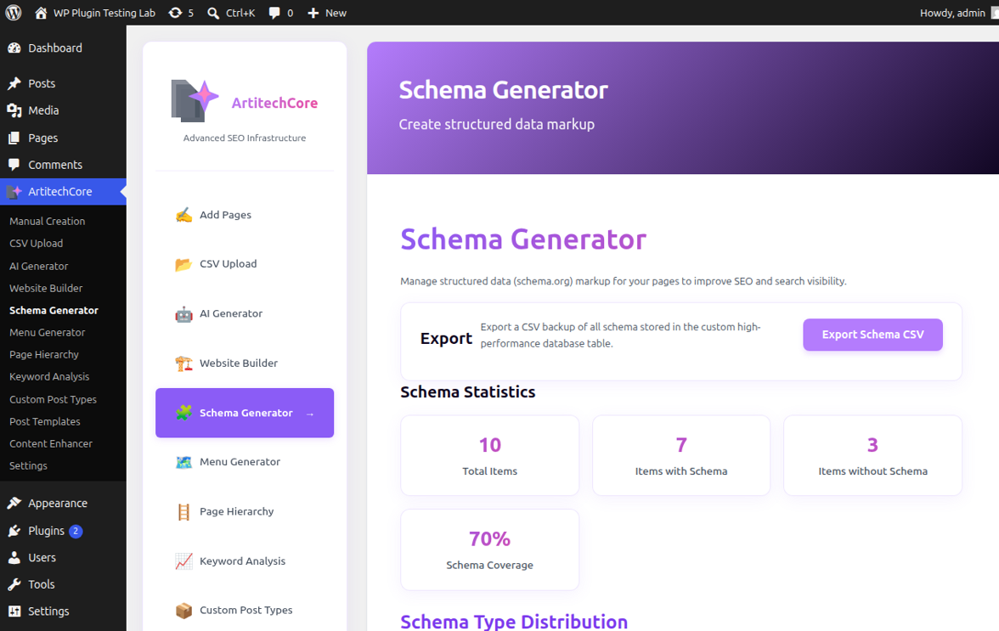

### 3. AI Generator — describe the business, get a page ecosystem
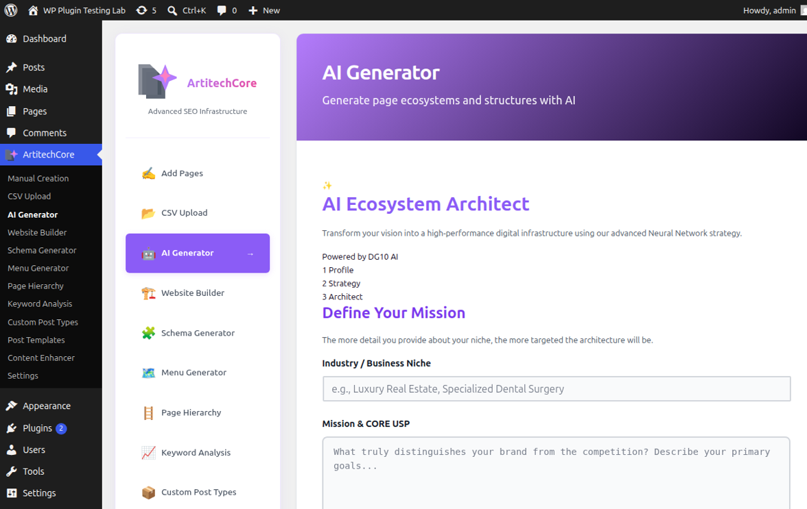

### 4. Settings — providers, keys, brand kit, business identity
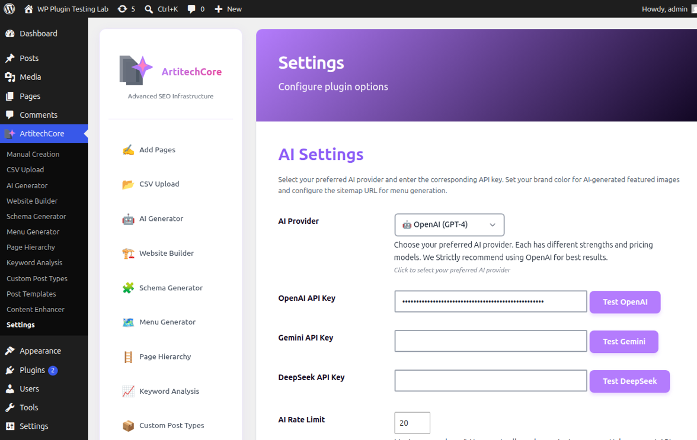

### 5. Website Builder — industry blueprints to full site
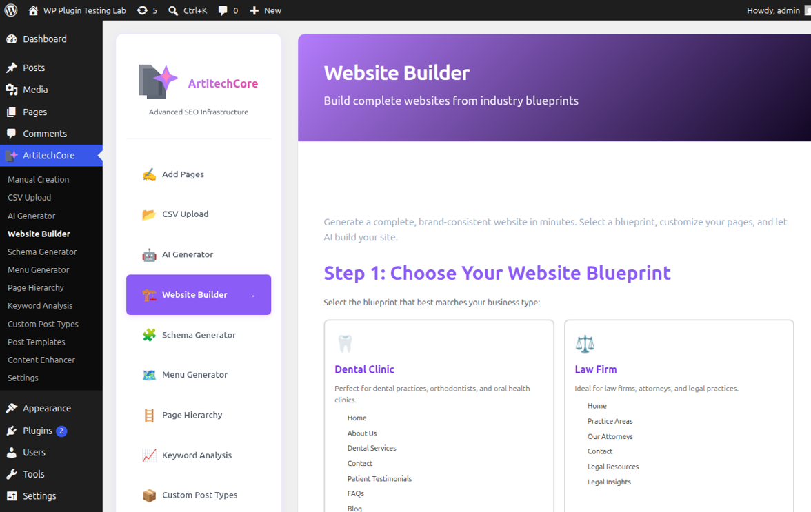

### 6. Content Enhancer — Key Takeaways, Conclusions, CTAs in bulk
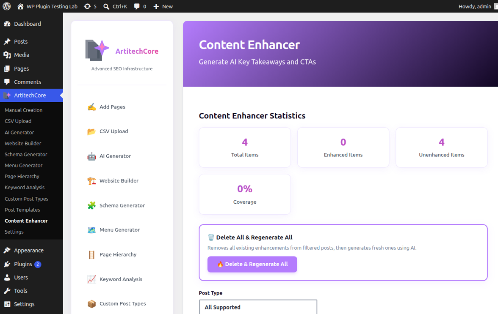

### 7. CSV Bulk Import — hundreds of SEO pages in seconds
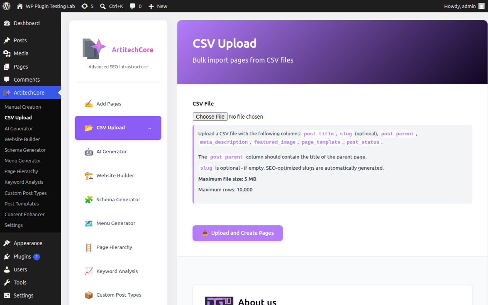

### 8. Menu Generator — nav, service and footer menus from hierarchy
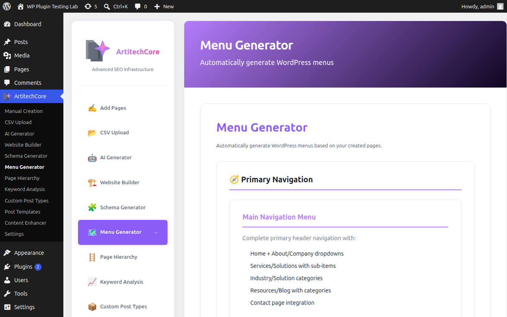

### 9. Page Hierarchy — visualize and manage site structure
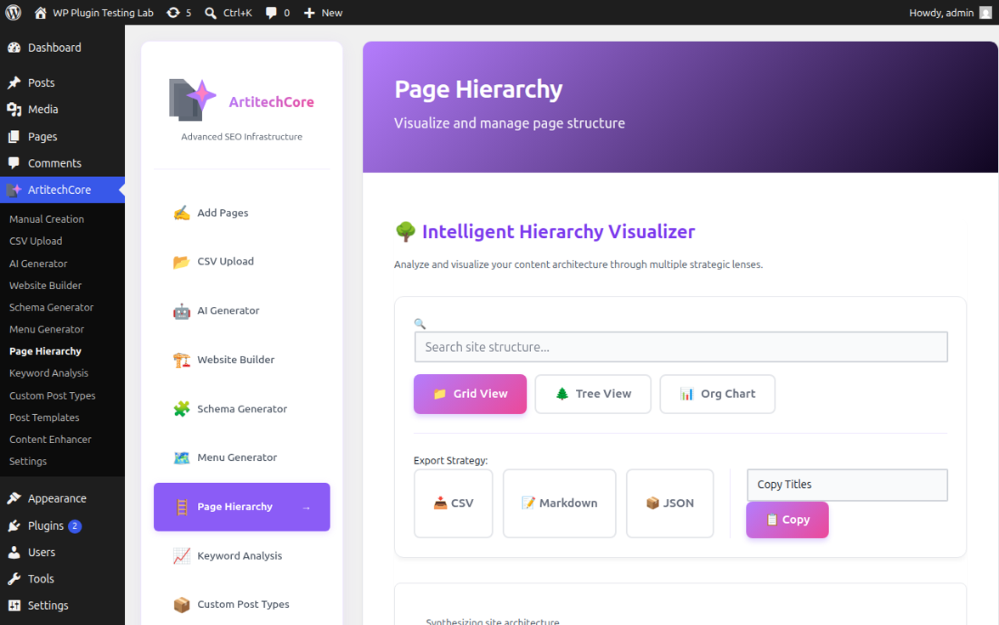

### 10. Keyword Analysis — density and on-page SEO signals
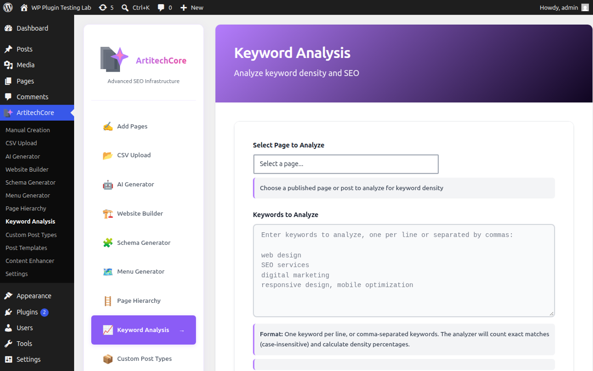

### 11. Custom Post Types — Doctors, Products and more per industry
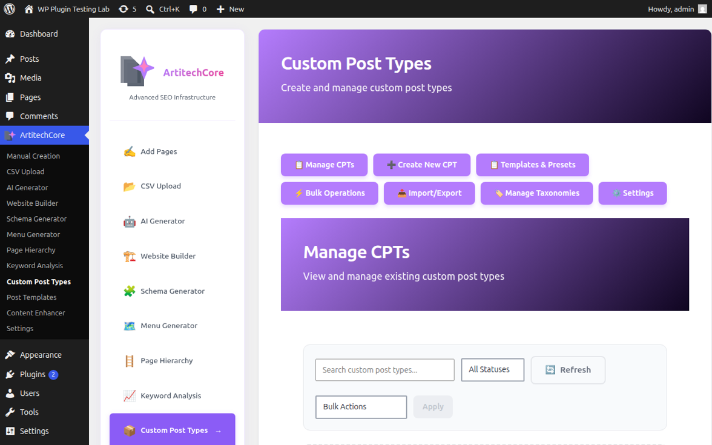

### 12. Post Templates — dynamic templates per post type
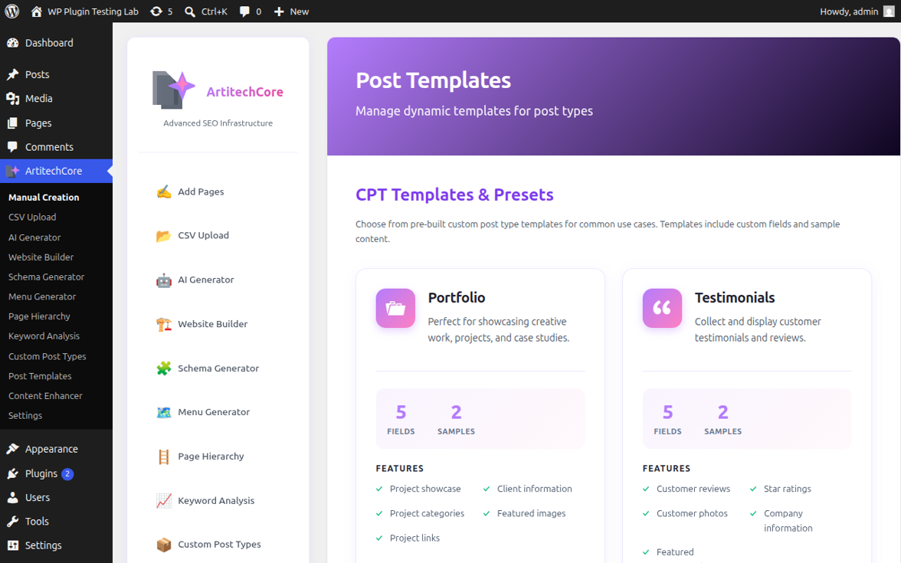

---

## Features

| Feature | What it does | SEO benefit |
|---|---|---|
| AI Website Builder | 8 industry blueprints → complete, brand-consistent sites | Correct site architecture from day one (crawlability, internal linking) |
| Auto Schema Engine | JSON-LD `@graph` per URL: Organization, WebSite, WebPage, BreadcrumbList + page-true main entity (Service, FAQPage, MedicalBusiness/Dentist, BlogPosting, …) | Rich-result eligibility, entity understanding |
| Schema Dashboard | Coverage stats, per-type distribution, preview / regenerate / remove, CSV export | Auditable structured data at scale |
| AI Content Enhancer | Key Takeaways (TL;DR), Smart Conclusions, adaptive CTAs | Dwell time, semantic structure, conversions |
| CPT & Taxonomy Engine | Business-specific post types (Doctors, Products…) + taxonomies | Clean content modeling per industry |
| CSV Bulk Import | Hundreds of pages with validation + parent-child mapping | Programmatic SEO at scale |
| Menu Generator | Nav / service / footer menus from hierarchy | UX + crawl paths |
| Page Hierarchy | Visual sitemap of the whole site | Architecture audits in one glance |
| Keyword Analysis | Density + SEO signals per post | On-page tuning |
| Post Templates | Dynamic templates per post type | Consistent, schema-ready output |
| Persistence Bridge | Enhancements survive deactivation via `mu-plugins` | No SEO loss on plugin changes |

### How the schema engine works (30 seconds)
1. **Learns the business once** — settings + AI entity profile + content detection (settings win on disagreement).
2. **Types each page** — AI content analysis → keyword fallback; one row stored per schema type, merged into a single deduped `@graph` at render.
3. **Never leaves a URL bare** — archives, search, and 404 get Organization + WebSite; static front pages get a persisted homepage node.
4. **Stays honest** — unknown specialties/ratings are **omitted**, never invented.

---

## Installation

1. Download `artitechcore-1.0.0.zip` from the [1.0.0 release](https://github.com/DG10-Agency/ArtitechCore-WP/releases/tag/1.0.0).
2. WordPress admin → **Plugins → Add New → Upload Plugin**, upload the ZIP, **Activate**.
3. Open **ArtitechCore → Settings**, pick a provider (OpenAI / Gemini / DeepSeek), paste your API key, hit **Test**.
4. Fill **business identity** (name, phone, email, address) — this is what ships in your public schema.
5. Open **Schema Generator** → bulk **Generate Schema**, then view any page source for the `ArtitechCore Schema` JSON-LD block.

Requires: WordPress 5.6+, PHP 7.4+, MySQL 5.6+ / MariaDB 10.0+, 128 MB PHP memory for bulk runs.

---

## FAQ

**Does it replace Yoast / Rank Math?**
No — it complements them. ArtitechCore outputs its own JSON-LD additively and notes coexistence in the markup comment. Keep your SEO plugin; ArtitechCore adds the entity/schema layer.

**Which schema types are supported?**
FAQ, HowTo, Service, Product, Review, Event, Article, BlogPosting, Organization, LocalBusiness, MedicalBusiness (incl. Dentist via AI typing), WebPage, WebSite, BreadcrumbList, CollectionPage for term archives. One valid `@graph` per URL, `@id`-deduped.

**Which AI provider should I use?**
OpenAI for best structure/content quality, Gemini for high-speed bulk suggestions, DeepSeek as the cost-effective option. All three are first-class in Settings.

**Is my API key safe?**
Keys live in your WordPress database, are used only for direct server-to-server calls, and never reach the frontend. Disable AI anytime in Settings.

**Will markup survive deactivation?**
Content Enhancer output persists via the optional Persistence Bridge (`mu-plugins`). Schema rows stay in your database unless you opt into deletion at uninstall.

**Can I audit/export my schema?**
Yes — the Schema dashboard exports all stored structured data to CSV, with per-type distribution stats.

---

## Changelog

### 1.0.0 (first public release)
- Auto-schema engine: multi-row storage + merged `@graph`, `@id` resolver, `MedicalBusiness` builder, omit-when-unknown specialties.
- Link-consent compliance system, full GPL license, CI release pipeline (Plugin Check gate + signed ZIP artifacts).
- See [releases](https://github.com/DG10-Agency/ArtitechCore-WP/releases) for the installable ZIP.

---

## License & Privacy

GPLv2 or later — see [LICENSE](LICENSE). No tracking: AI features send page content + business context only to the provider **you** configure ([OpenAI](https://openai.com/privacy/) · [Google](https://policies.google.com/privacy) · [DeepSeek](https://deepseek.com/privacy)). Nothing goes to DG10 servers.

Built by [DG10 Agency](https://github.com/DG10-Agency) · Issues welcome on GitHub.
